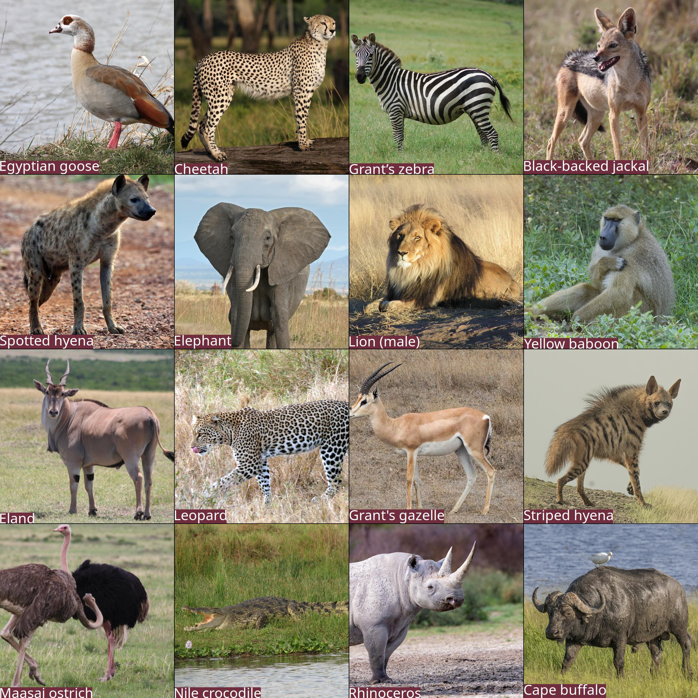

# Safari Bingo Cards
Fun proof of concept to generate random wildlife bingo cards for safaris with data from Wikipedia.

<p align="center">
  
</p>

# Usage
Once the requirements are satisfied you can generate a card. By default it generates a 4x4 grid with 16 images:

```console
$ ./generate.py -i data/animals.csv -o out.jpg
[INFO] Generated random sample of 32 animals...
[INFO] > Creating thumbnail for Helmeted guineafowl...
[INFO] Generated card with a 4x4 grid of animals...
[INFO] Wrote out.jpg
```

The script will download the images from Wikipedia, generate thumbnails for the sampled animals, and output a bingo card as a JPEG file.

# Requirements
Set up a Python 3.11+ virtual environment and install the requirements:

```console
$ python3 -m .venv
$ source .venv/bin/activate
$ pip install -r requirements.lock
```

# TODO

- Credit photographers — these photos are all some variation of CC-BY so we need to give attribution
- Add filtering by region — the metadata already exists, though perhaps needs to be adjusted
- Refactor — perhaps needs to be more object oriented
- Make a web frontend — I can imagine a light frontend that would shuffle the images in realtime and allow generation of a number of cards

# License
This work is licensed under the [GPLv3](https://www.gnu.org/licenses/gpl-3.0.en.html).

The license allows you to use and modify the work for personal and commercial purposes, but if you distribute the work you must provide users with a means to access the source code for the version you are distributing. Read more about the [GPLv3 at TL;DR Legal](https://tldrlegal.com/license/gnu-general-public-license-v3-(gpl-3)).
